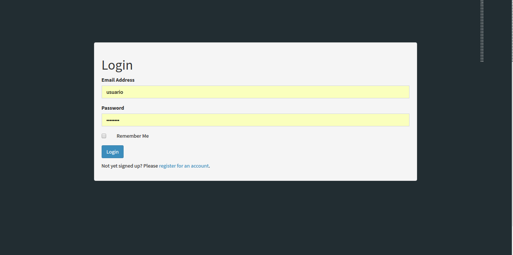
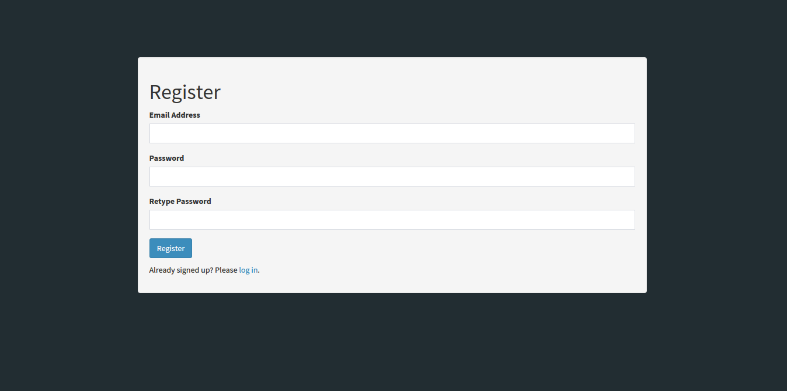
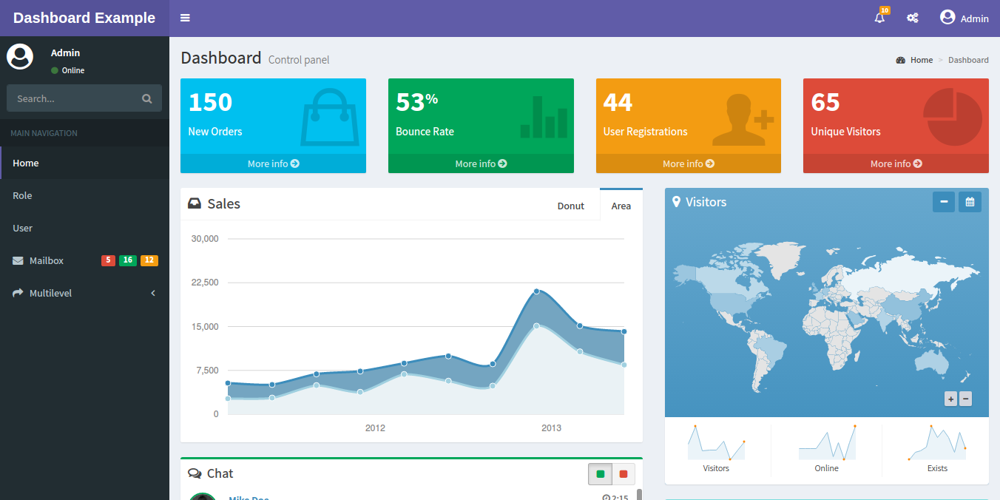
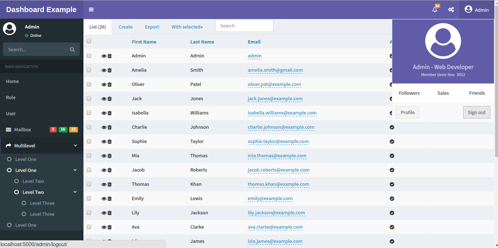
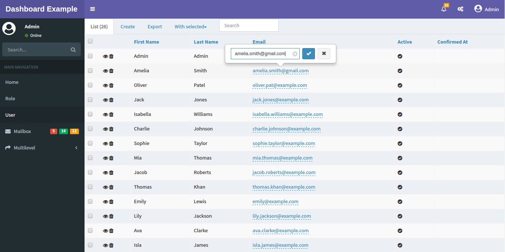
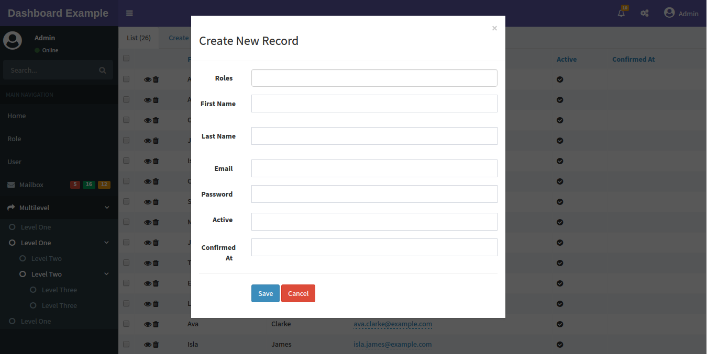
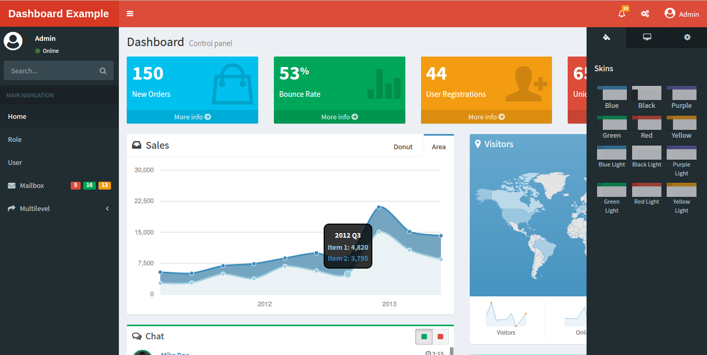

# Flask-Admin Dashboard Example

Basic dashboard app with Admin LTE template and Flask Admin, it has:

- User Registration
- Login as general or admin user
- Roles management
- Create form in modal window by default
- Inline editing enabled by default
- Skins and  layout customization
- Dashboard, charts, chat and calendar examples
 
Utilities: 

  - AdminLTE Bootstrap template
  - Flask-Security
  - Flask-Admin
  - A lot of Charts libraries
  - SQLite


### How to use

- Clone or download the git repository.
    ```sh
    $ git clone https://github.com/jonalxh/Flask-Admin-Dashboard.git
    ```
- Create and activate a virtual environment:
    ```sh
    $ virtualenv venv
    $ source venv/bin/activate
    ```
- Install the requirements inside the app folder
    ```sh
    $ pip install -r requirements.txt
    ```
- Once the process finishes give execution permission to app.py file and run it
    ```sh
    $ chmod +x app.py
    $ ./app.py
    ```
- The first execution will create automatically a sample sqlite database.
- Open your favorite browser and type
    ```
    localhost:5000/admin
    ```
    then just log in with the default user or register one. 

### Screenshots










**I hope you enjoy it.**
